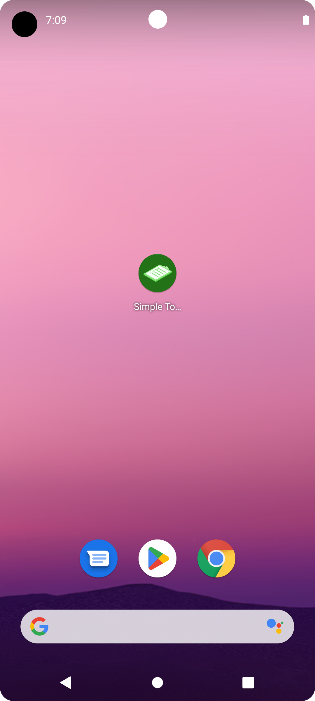
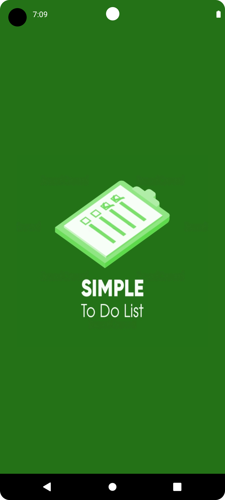
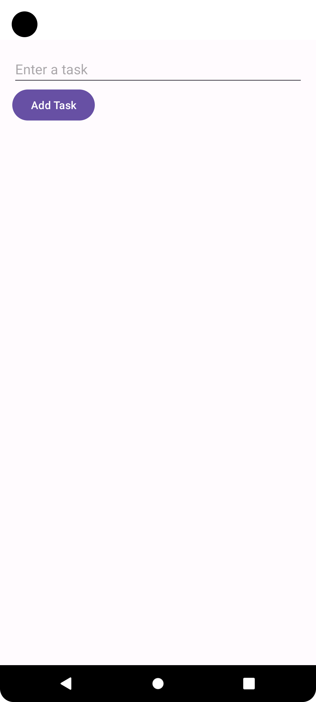
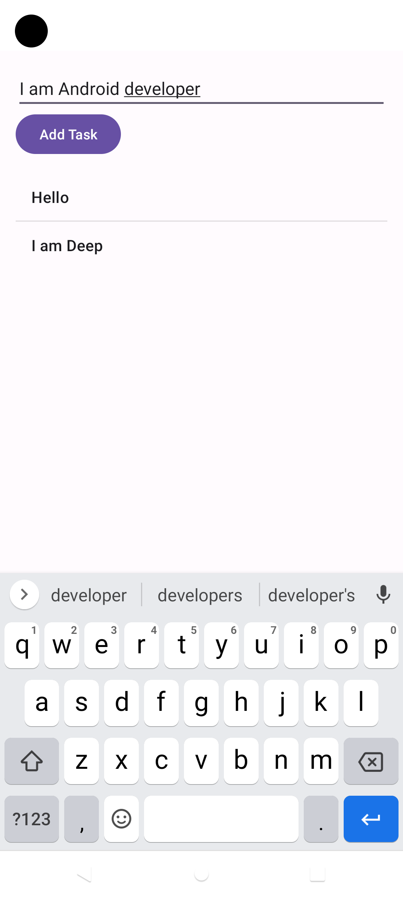
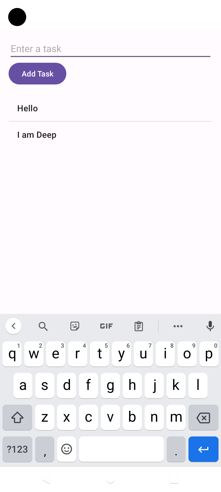

# Simple_ToDoList

This Android app provides a straightforward to-do list experience. The user interface features an input field for entering tasks, a "Add Task" button, and a scrollable list view to display tasks. Users can input tasks into the text field and press the "Add Task" button to append them to the list. Existing tasks can be removed by tapping on them. The app employs an ArrayList and ArrayAdapter to manage task data and list display efficiently. This app offers a convenient and minimalist way to manage tasks on the go.

## App-Preview
 

  

